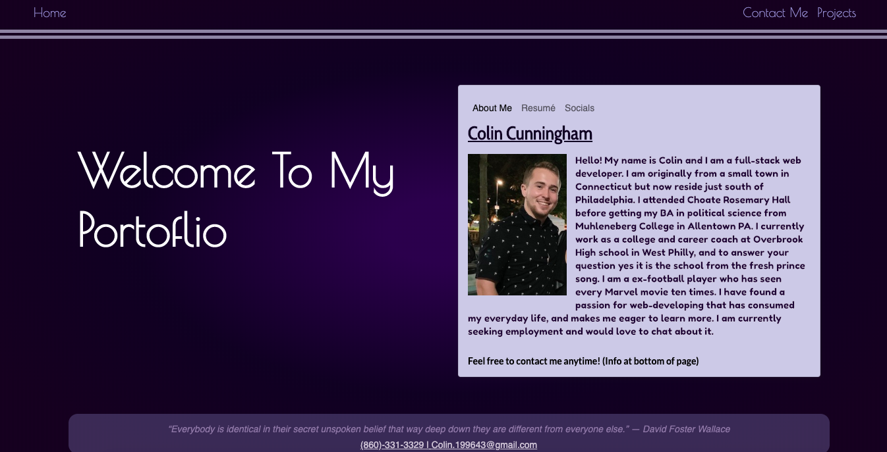

# Cunningham-Portfolio
# User Story
// _AS A_... employer seeking qaulified people to fill a postition // _I WANT_... to find an employee who can create a clean, and informative potfolio website //_SO THAT_... I can hire him to become and asset at my company.

# Design Inputs

* This is one of many iterations of this page. At first I tried to introduce a “L” shape in order to create a better design concept… which turned out to be the WRONG idea. I then studied websites that catered to business’s and the concept of the invite scroll. Cause research suggests that an infinite scrolling page is better to hold someones attention. However this did not translate to a portfolio page. So I decided to look up portfolio pages that already exist, and settled on a simplistic design that I think will best show my talents. I could have added more bells and whistles but sometimes its best to keep it simple. Overall this project of creating something that represents me has taught me the value of restraint. 

